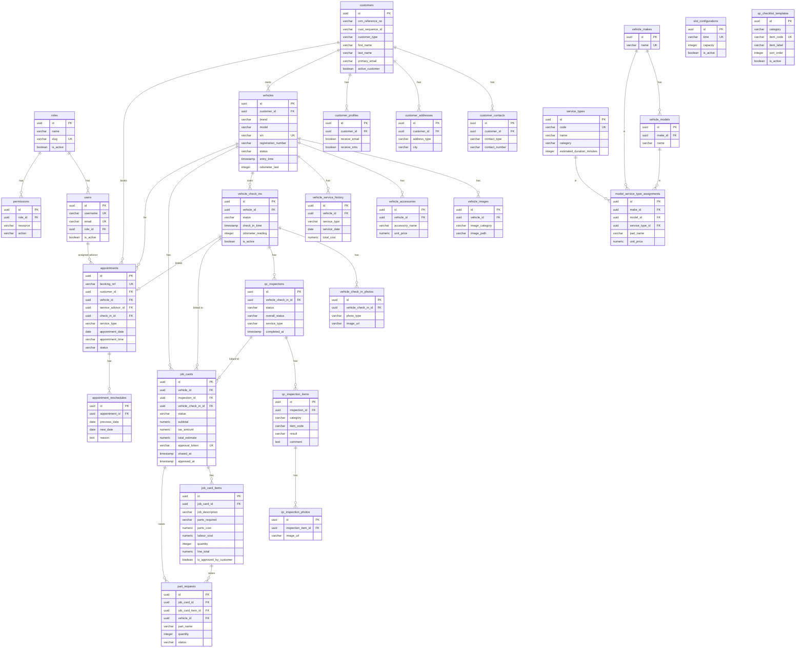

# WorkShop Backend — Database Schema Notes

## Quick System Overview

This is a **vehicle workshop management system**. The core flow is:

```
Customer → Vehicle → Check-In → QC Inspection → Job Card → Parts → Billing
```

---

## Table Groups

### 1. AUTH & USERS
| Table | Purpose | Key FK |
|-------|---------|--------|
| `roles` | Role definitions (admin, advisor, etc.) | — |
| `users` | System login accounts | `role_id → roles` |
| `permissions` | What each role can access | `role_id → roles` |

### 2. CUSTOMERS
| Table | Purpose | Key FK |
|-------|---------|--------|
| `customers` | Customer master record | — |
| `customer_contacts` | Phone numbers per customer | `customer_id → customers` (cascade delete) |
| `customer_addresses` | Addresses per customer | `customer_id → customers` (cascade delete) |
| `customer_profiles` | Marketing consent / preferences | `customer_id → customers` (cascade delete) |

### 3. VEHICLES
| Table | Purpose | Key FK |
|-------|---------|--------|
| `vehicle_makes` | BMW, Toyota, etc. | — |
| `vehicle_models` | Models per make | `make_id → vehicle_makes` (cascade delete) |
| `vehicles` | Vehicle master record | `customer_id → customers` |
| `vehicle_images` | Stored photos | `vehicle_id → vehicles` (cascade delete) |
| `vehicle_accessories` | Factory/dealer accessories | `vehicle_id → vehicles` (cascade delete) |
| `vehicle_service_history` | Past service records | `vehicle_id → vehicles` (cascade delete) |

### 4. WORKSHOP VISIT (Check-In)
| Table | Purpose | Key FK |
|-------|---------|--------|
| `vehicle_check_ins` | One record per visit | `vehicle_id → vehicles` |
| `vehicle_check_in_photos` | Entry photos (Front/Rear/etc.) | `vehicle_check_in_id → vehicle_check_ins` |

### 5. QC INSPECTION
| Table | Purpose | Key FK |
|-------|---------|--------|
| `qc_checklist_templates` | Master checklist items (EXTERIOR/INTERIOR/BRAKE) | — |
| `qc_inspections` | One inspection per check-in | `vehicle_check_in_id → vehicle_check_ins` |
| `qc_inspection_items` | Per-item results (PASS/FAIL/NA) | `inspection_id → qc_inspections` |
| `qc_inspection_photos` | Photos per inspection item | `inspection_item_id → qc_inspection_items` |
| `qc_confirmation_components` | Components verified | `inspection_id → qc_inspections` |
| `qc_workshop_rework` | Rework notes | `inspection_id → qc_inspections` |

### 6. JOB CARDS & PARTS
| Table | Purpose | Key FK |
|-------|---------|--------|
| `job_cards` | Estimate/work order | `vehicle_id → vehicles`, `inspection_id → qc_inspections`, `vehicle_check_in_id → vehicle_check_ins` |
| `job_card_items` | Line items (labour + parts) | `job_card_id → job_cards` (cascade delete) |
| `part_requests` | Parts sent to Parts Manager | `job_card_id → job_cards`, `job_card_item_id → job_card_items`, `vehicle_id → vehicles` |
| `parts_master` | Parts catalogue | — |

### 7. APPOINTMENTS
| Table | Purpose | Key FK |
|-------|---------|--------|
| `slot_configurations` | Time slots and capacity | — |
| `appointments` | Booked appointments | `customer_id → customers`, `vehicle_id → vehicles`, `service_advisor_id → users`, `check_in_id → vehicle_check_ins` |
| `appointment_reschedules` | Reschedule history | `appointment_id → appointments` (cascade delete) |
| `complaints` | Complaint types reference data | — |

### 8. REFERENCE TABLES (standalone lookup data)
| Table | Purpose |
|-------|---------|
| `service_types` | Service type catalogue (code + name + duration) |
| `model_service_type_assignments` | Maps Make+Model → Service Type + parts |
| `vehicle_conditions` | Condition codes |
| `vehicle_colours` | Ext/Int colour codes |
| `provinces` | Province lookup |
| `ro_statuses` | Repair Order statuses |
| `service_advisors` | Advisor records (separate from users) |

---

## Vehicle Status Flow

```
Entry (Draft)
    ↓  [security confirms entry]
Vehicle IN
    ↓  [QC inspector starts]
Inspection (Draft)
    ↓  [QC inspection completed]
Inspection Done
    ↓  [SA creates job card]
Job Card (Draft)
    ↓  [SA requests parts approval]
Job Card (Pending Parts Approval)
    ↓  [Parts manager confirms]
Job Card (Parts Approval Done)
    ↓  [SA shares estimate with customer]
Job Card (Pending Cust. Approval)
    ↓
  ┌─ Job Card (Full Cust. Approval)
  └─ Job Card (Partial Cust. Approval)
    ↓  [work begins]
In Service
    ↓  [work completed]
Ready for Billing
    ↓  [payment done]
Completed
```

---

## Job Card Status Flow

```
DRAFT
  ├─→ PENDING_PARTS (parts needed)
  │       ↓
  │   PARTS_CONFIRMED
  │       ↓
  └─→ SHARED (estimate sent to customer)
          ├─→ APPROVED
          ├─→ PARTIALLY_APPROVED
          ├─→ REJECTED
          └─→ MODIFICATION_REQUESTED
                  ↓ (SA edits)
              back to DRAFT
```

---

## How to Query Across Tables (Drizzle ORM)

```typescript
// Get vehicle with customer info
const [vehicle] = await db
  .select()
  .from(vehicles)
  .leftJoin(customers, eq(vehicles.customerId, customers.id))
  .where(eq(vehicles.id, vehicleId));

// Get job card with items
const jobCard = await db.select().from(jobCards).where(eq(jobCards.id, id));
const items = await db.select().from(jobCardItems).where(eq(jobCardItems.jobCardId, id));

// Get QC inspection via check-in
const [inspection] = await db
  .select()
  .from(qcInspections)
  .innerJoin(vehicleCheckIns, eq(qcInspections.vehicleCheckInId, vehicleCheckIns.id))
  .where(eq(vehicleCheckIns.vehicleId, vehicleId));

// Cascade delete — deleting a customer automatically deletes:
//   customer_contacts, customer_addresses, customer_profiles
// Deleting a vehicle deletes:
//   vehicle_images, vehicle_accessories, vehicle_check_ins,
//   vehicle_service_history (and their children)
```

---

## ER Diagram (Mermaid)



---

## Key Rules to Remember

| Rule | Detail |
|------|--------|
| **One visit per vehicle** | `vehicle_check_ins` has `is_active` flag — only one active at a time |
| **One inspection per visit** | `qc_inspections` links to `vehicle_check_in_id` |
| **Job card links three things** | `vehicle_id` + optionally `inspection_id` + `vehicle_check_in_id` |
| **Part request lifecycle** | `pending → available/unavailable → dispatched` |
| **Approval token** | Generated on job card `SHARED`, 64-char unique token for customer approval URL |
| **Cascade deletes** | Contacts/addresses delete with customer; images/check-ins/job-cards delete with vehicle |
| **Slot capacity** | `slot_configurations` limits how many appointments per time slot |
